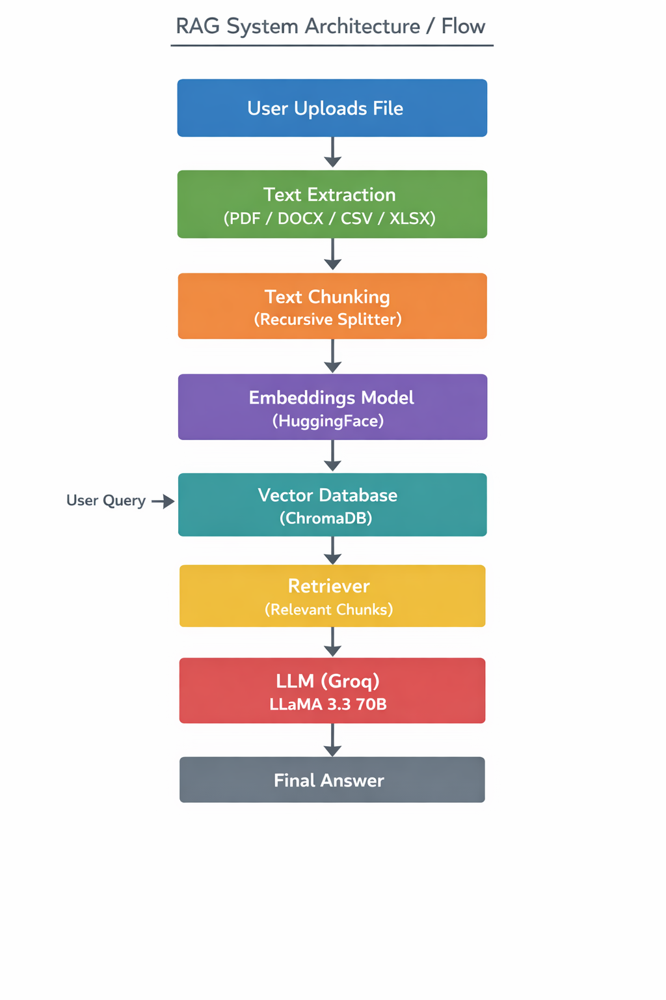

# 📄 RAG-Based Document Q&A System

## 🚀 Overview
This project is a Retrieval-Augmented Generation (RAG) application that allows users to upload documents (PDF, DOCX, CSV, Excel) and ask questions based on their content.

Instead of relying only on a language model, this system:
- Retrieves relevant document chunks
- Feeds them as context to an LLM
- Generates accurate, context-aware answers

---

## 🧠 How It Works (Simple Flow)

Upload File → Extract Text → Split into Chunks → Create Embeddings → Store in Vector DB → Retrieve Relevant Data → Ask LLM → Get Answer



----

## ⚙️ Tech Stack

- **LangChain** – pipeline orchestration  
- **ChromaDB** – vector database  
- **HuggingFace Embeddings** – text vectorization  
- **Groq API (LLaMA 3.3 70B)** – LLM for answering  
- **PyPDF / python-docx / pandas** – document parsing  
- **Google Colab** – development environment  

---

## 📂 Supported File Types

- PDF  
- DOCX  
- CSV  
- Excel (.xlsx)  

---

## 🔧 Installation

```bash
pip install langchain langchain-community langchain-core chromadb sentence-transformers pypdf python-docx pandas groq openpyxl
```

---

## 🔑 Setup

Set your Groq API key:

```python
import os
os.environ["GROQ_API_KEY"] = "YOUR_API_KEY"
```

---

## ▶️ Usage

1. Run the notebook  
2. Upload your document  
3. Ask a question:  
   What would you like to ask about the document?  
4. Get context-based answers  

---

## 📌 Key Features

- Multi-format document support  
- Semantic search using embeddings  
- Persistent vector database (ChromaDB)  
- Context-aware LLM responses  
- Lightweight and scalable  

---

## 🧪 Example Use Cases

- Study assistant (notes → questions)  
- Resume analyzer  
- Business report insights  
- Legal/contract document querying  

---

## ⚠️ Limitations

- Answers depend only on provided context  
- Large files may increase processing time  
- Requires API key for LLM access  

---

## 🔮 Future Improvements

- Web UI (Streamlit / React)  
- Multi-document querying  
- Chat history memory  
- Deployment (AWS / Vercel)  
- Authentication system  

---

## 👨‍💻 Author

**Ajay K**  
CSE Student | AI & Backend Enthusiast  

---

## ⭐ If you like this project

Give it a star on GitHub and share it!
